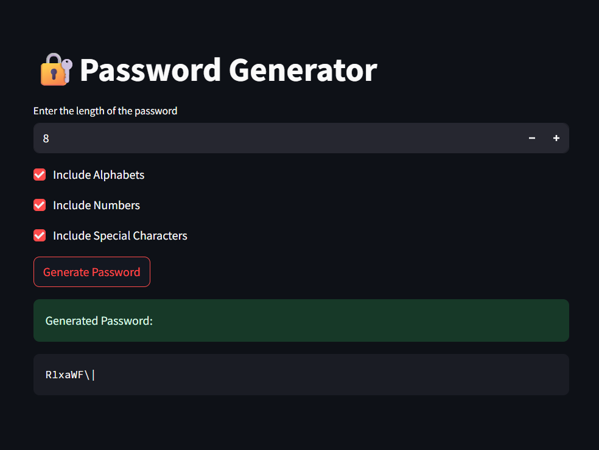

# 🔐 Password Generator App

A simple and customizable password generator built using [Streamlit](https://streamlit.io/). This app allows users to generate secure passwords by choosing the desired length and selecting whether to include alphabets, numbers, and special characters.

---

## 📸 Demo



---

## 🚀 Features

- Set password length (minimum 4 characters)
- Choose character types:
  - ✅ Alphabets (A–Z, a–z)
  - ✅ Numbers (0–9)
  - ✅ Special Characters (!, @, #, etc.)
- Generates a random secure password instantly
- Clean and responsive UI with Streamlit

---

## 🧠 How It Works

1. User selects the desired length of the password (4–100 characters).
2. User chooses which character sets to include.
3. The app generates a random password from the selected sets.
4. The password is displayed in a code block for easy copying.

---

## 🧑‍💻 Tech Stack

- Python 3
- Streamlit

---

## 🛠️ Getting Started

You can run this app locally with the following steps:

### ✅ Prerequisites

- Python 3.7 or higher installed

### 📦 Installation & Run

```bash
# 1. Clone the repository (or download the files)
git clone https://github.com/your-username/password-generator.git
cd password-generator

# 2. Install Streamlit
pip install streamlit

# 3. Run the app
streamlit run app.py
